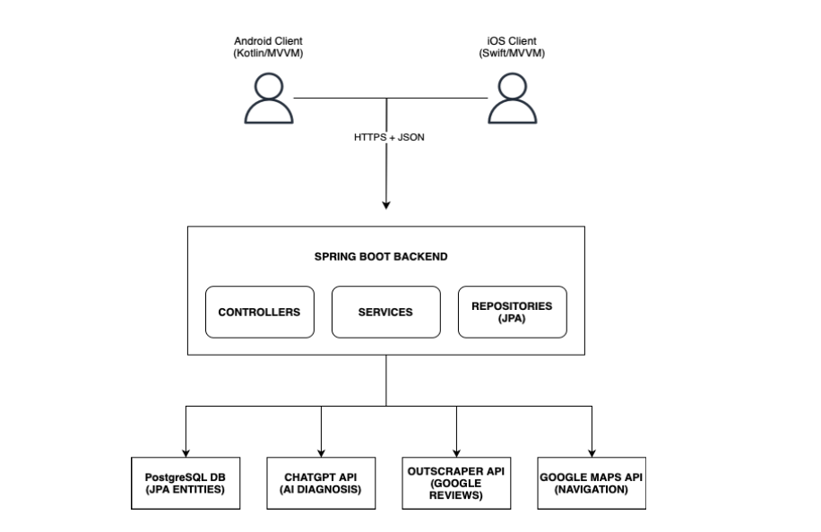

# Ideal Ustam Backend API

> Designed & documented by Rozana Saleem as a backend architecture and API documentation showcase.

A RESTful backend system built using Spring Boot, designed to support a vehicle fault diagnosis and mechanic recommendation application.

This repository demonstrates backend architecture design, structured API documentation, authentication flow, and external service integration.

---

##  Tech Stack

- Java 17  
- Spring Boot  
- Spring Data JPA  
- Spring Security (JWT Authentication)  
- PostgreSQL  
- OpenAPI / Swagger  
- Gradle  

---

##  System Architecture

The backend follows a layered architecture pattern:

- Controllers (REST endpoints)  
- Services (business logic)  
- Repositories (data access layer)  
- External integrations (AI service, Maps API, Scraper API)  

  

Detailed architecture documentation available in:

 `docs/architecture/`

---

##  Authentication Flow

JWT-based authentication is implemented using Spring Security.

  

More details:  
 `docs/authentication.md`

---

##  Application Workflow

The following diagram illustrates the user journey from fault selection to mechanic recommendation.

  

More details:  
 `docs/flows/`

---

##  API Documentation

The API is fully documented using OpenAPI (Swagger).

- API Overview → `docs/api-overview.md`  
- Endpoints → `docs/endpoints.md`  
- Error Handling → `docs/error-handling.md`  
- OpenAPI Specification → `swagger/openapi.yaml`  

---

##  Key Features

- Fault type selection logic  
- Dynamic fault-specific question flow  
- Mechanic recommendation engine  
- AI-based diagnosis integration  
- External API integrations  
- Standardized API response structure  
- Structured error handling  

---

##  Project Structure

backend/
├── src/
├── docs/
│ ├── api-overview.md
│ ├── authentication.md
│ ├── endpoints.md
│ ├── error-handling.md
│ ├── architecture/
│ ├── flows/
├── swagger/
│ └── openapi.yaml

---

## Purpose of This Repository

This repository serves as:

- A backend system implementation example  
- A structured API documentation showcase  
- A technical writing portfolio piece demonstrating system documentation practices  

---

##  Author

Rozana Saleem  
Computer Engineering Graduate  
Backend & Technical Documentation Specialist  
